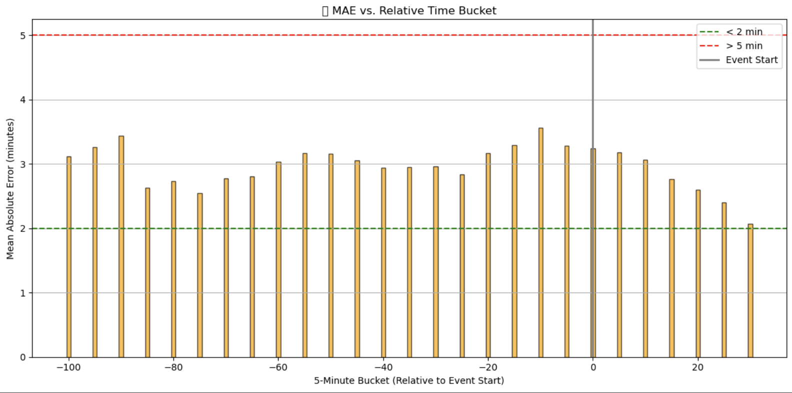
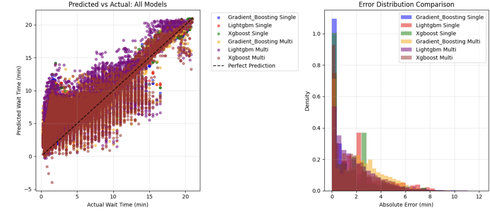
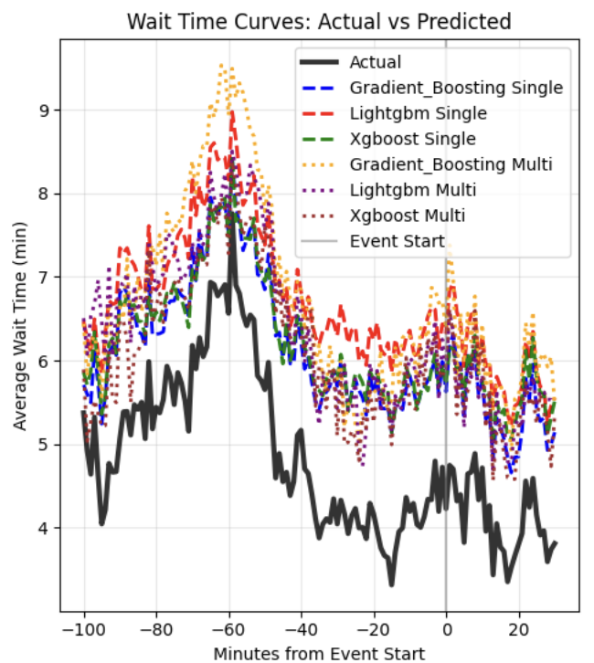

# 🚦 Event Wait Time Prediction at Barclays Center

This repository showcases my work on **predictive modeling of ingress wait times** for large-scale events (NBA, WNBA, concerts, family shows) at Barclays Center, home of the Brooklyn Nets and New York Liberty.  
The project was developed during my **Data Analytics Internship at BSE Global**, where I built and evaluated machine learning pipelines to optimize event-day operations and enhance the fan experience.  

---

## 📌 Project Overview

### Problem
Managing large crowds at live events requires anticipating **queue congestion** at the main entry gate. Traditional staffing decisions relied heavily on historical averages and manual adjustments, often failing to capture event-specific dynamics (e.g., weather, genre, arrival patterns).

### Objective
- Predict **95th percentile wait times** per minute relative to event start.  
- Enable operations teams to adjust staffing and messaging **proactively**.  
- Reduce fan complaints and improve **Net Promoter Score (NPS)**.

---

## 🧠 Methodology

### Data Sources
- **Ingress scans** from turnstiles (line length, arrival time, throughput) from S3/Snowflake.  
- **Event metadata**: genre, performer/team, property (Nets vs Liberty vs Barclays events) from Dbeaver.  
- **Weather API**: temperature, precipitation, severe weather flags.  
- **External factors**: MTA delays, day of week, weekend flags, holidays.  

### Feature Engineering
- Historical rolling queue statistics: `queue_mean_3`, `queue_slope_5`.  
- Event patterns: genre congestion factors, early-arrival risk scores.  
- Cyclical encoding for time (`hour_sin`, `day_sin`, `minute_sin`).  
- Weather-driven modifiers (temperature bins, precipitation intensity).  
- Attendance scaling and **expected crowd intensity** multipliers.  

### Models
- **Quantile Regression** for 95th percentile prediction.  
- **Tree-based methods** (LightGBM, CatBoost, XGBoost, Gradient Boosting).  
- **Baselines**: Historical averages and regression benchmarks.  
- Grouped cross-validation to preserve **event-level independence**.  

---

## 📊 Results & Insights

### 🔍 Key Modeling Insights
- **Stable Accuracy Across Time:** MAE stayed between **2–4 minutes** across all 5-minute buckets relative to event start.  
- **Model Benchmarking:** LightGBM and XGBoost multi-minute models outperformed single-step models, reducing MAE to **~1.7–1.8 minutes**.  
- **Error Distribution:** >80% of predictions fell within **±2 minutes**, ensuring operational reliability.  
- **Congestion Tracking:** Predicted wait time curves closely mirrored actual ingress patterns, including pre-event spikes.  

---

### 🔧 Visualizations

#### 1. Model Stability Over Time
Shows Mean Absolute Error (MAE) across 5-minute buckets relative to event start.  
Model remains well below the 5-minute threshold, demonstrating robustness.

---

#### 2. Model Benchmarking
**Left:** MAE comparison (single vs multi-minute models).  
**Right:** Error distribution showing tight prediction intervals.  

---

#### 3. Actual vs Predicted Curves
Predicted curves successfully track real-world congestion patterns, allowing operations to anticipate bottlenecks.  

---

## ⚙️ Tech Stack

- **Languages**: Python (pandas, numpy, scikit-learn, LightGBM, CatBoost, XGBoost)  
- **Visualization**: Tableau, matplotlib  
- **Data Infrastructure**: AWS S3 → Snowflake ETL pipelines  
- **Collaboration**: Jupyter, Git, Slack, stakeholder presentations  

---

## 🚀 Next Steps

- **Model Refinement**: Incorporate live ingress + real-time weather feeds.  
- **Hybrid Models**: Combine quantile regression + boosting for sharper tail predictions.  
- **Operational Integration**: Automate Tableau dashboards for day-of-event decisioning.  
- **Simulation**: Test “what-if” staffing/gate allocation scenarios.  

